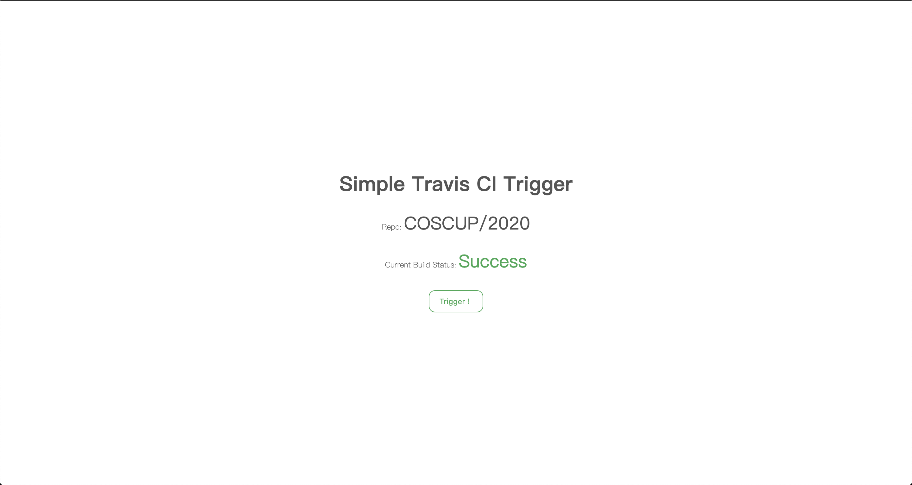

<!--
 Copyright (c) 2020 DevilTea
 
 This software is released under the MIT License.
 https://opensource.org/licenses/MIT
-->

# Simple Travis CI Trigger

A simple and tiny trigger page for Travis CI

> only for "api.travis-ci.org"

## Quick Start

1. Configure your `config.json`. (ref: `config.example.json`)
  ```json
  {
    "port": 5000, // the port that service would be hosted
    "sessionKeys": ["keys", "keyskeys"], // keys for csrf
    "travis": {
      "token": "your travis token", // as the value :)
      "repository": { // one of id or slug is needed
        "id": "", // 1st priority
        "slug": "COSCUP/2020", // 2nd priority
        "branch": "master" // the branch to trigger
      }
    }
  }
  ```

2. Install dependencies
  ```bash
  $ npm i
  ```

3. Start the service
  ```bash
  $ npm run start
  ```

4. Check `localhost:{port}` in browser
  